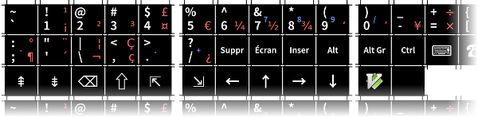

keyboard-stickers
=================

Localize your keyboard!

Print your own key stickers, ready to paste on your keyboard.

Generate the sheet using ``make``, then print it on adhesive paper.

Screenshot
----------

Requirements
------------

Python 3, ``pip install pysvg-py3`` and ImageMagick.

Resources
---------

https://upload.wikimedia.org/wikipedia/commons/e/ea/KB_USA-international.svg
